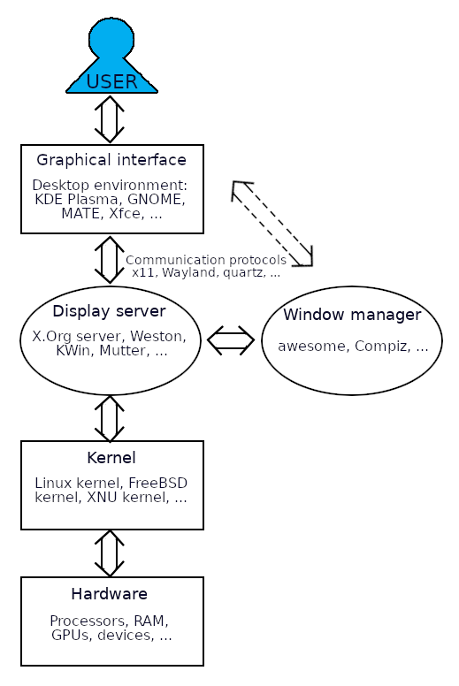

# Introduction to Linux

- Welcome page and syllabus: <a href="https://hpc2n.github.io/intro-linux/index.html">https://hpc2n.github.io/intro-linux/index.html</a>
    - Also link at the House symbol at the top of the page. 

!!! Admonition "Learning outcomes"

    - What is Linux?
    - Learn about the command line interface (CLI)
    - Navigate the file system 
        - **ls** list files
        - **mkdir** create directory
        - **cd** change directory
        - **rm** remove/delete a file (or directory, with the right flags)
        - **cp** copy a file or directory
        - **mv** rename or move a file or directory
        - **redirection** send output/input to specific files
        - **pipes** take the output of one command and use it as input for another command 
        - **and more**  
    - Data handling - compressing, archiving, file transfer, patterns, etc.  
    - Hints and tricks of Linux

## Why Linux 

- Most HPC centers supercomputers run some flavour of Linux. 
- It is stable and reliable
- Customizable
- Runs on any hardware
- Strong community
- Many flavours are open source and free
- Lots of applications
- Lightweight

## What is Linux

Linux is a family of open-source Unix-like operating systems based on the Linux kernel, an operating system kernel first released on September 17, 1991, by Linus Torvalds.

An operating system is the software that sits underneath all of the other software on a computer, managing the computer’s hardware (CPU, GPU, memory, storage...) and taking care of the connections between your other software and the hardware. 

Linux is typically packaged as a Linux distribution, which includes the kernel and supporting system software and libraries, many of which are provided by the GNU Project.

!!! Note "Distributions (distros)"

    There are many Linux distribuitions, including Ubuntu, Debian, Fedora, Gentoo, and many others. Many distributions are free and open source, but there are also commercial distributions, like Red Hat Enterprise and SUSE.

    Desktop Linux distributions include <a href="https://en.wikipedia.org/wiki/Desktop_environment" target="_blank">a desktop environment</a>, like GNOME, MATE, KDE Plasma, Xfce, Unity, or many others. A window manager together with applications written using a widget toolkit are generally responsible for most of what the user sees.

In addition, a windowing system of some sort (X11, Wayland) interfaces directly with the underlying operating system and libraries, providing support for graphical hardware, pointing devices, and keyboards. The window manager generally runs on top of this windowing system.

{: style="width: 400px;float: right;padding: 3px;}

While the use of Linux on desktop is only 2-3%, the vast majority of web servers (>96%), most mobile devices (Android is based on the Linux kernel), and all supercomputers on the <a href="https://en.wikipedia.org/wiki/TOP500" target="_blank">Top500</a> list run Linux.

## More information 

There is much more information about <a href="https://en.wikipedia.org/wiki/Linux" target="_blank">Linux on Wikipedia</a>.

Some pages with guides and/or cheat sheets: 

- <a href="https://linuxhandbook.com/" target="_blank">The Linux Handbook</a>
- <a href="https://www.geeksforgeeks.org/linux-tutorial/" target="_blanks">https://www.geeksforgeeks.org/linux-tutorial/</a>
- <a href="https://itsfoss.com/free-linux-training-courses/" target="_blank">14 Free Training Courses to Learn Linux Online</a>
- <a href="https://tldp.org/LDP/intro-linux/intro-linux.pdf">Introduction to Linux - A Hands on Guide</a>
- <a href="https://cloudacademy.com/course/linux-fundmentals-1346/the-linux-directory-structure/" target="_blank">Linux Fundamentals</a>
- <a href="https://www.digitalocean.com/community/tutorials/linux-commands" target="_blank">Top 50+ Linux Commands You MUST Know</a>
 
